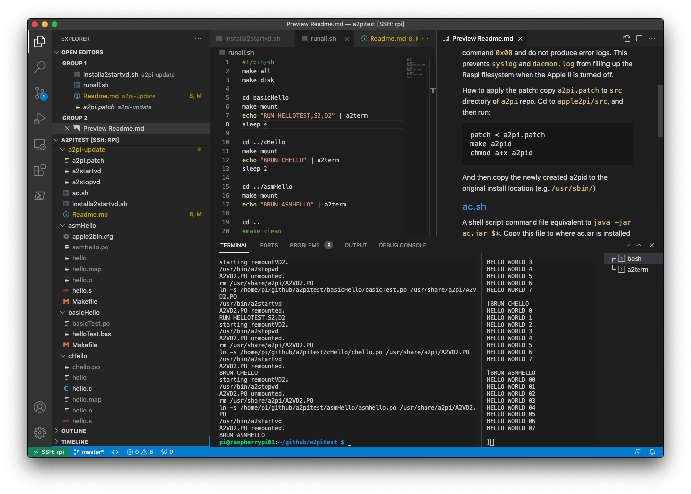

# A2PiTest 

Apple II remote development with Apple II Pi + Applesoft Basic + CC65.



This repo, `a2pitest`, should be placed on a Raspberry Pi (3+ or 4 recommended) connected to [Apple2Pi](https://github.com/dschmenk/apple2pi). By setting up [VSCode Remote Development](https://code.visualstudio.com/docs/remote/remote-overview) on the Raspbery Pi, you can develop Apple II software, in Basic, C or Assembly language, from your modern PC (Win/Mac/Linux).

## Prerequisites

Install the following on a Raspberry Pi which is connected to the Apple2Pi card:

* [Apple2Pi card & software](https://github.com/dschmenk/apple2pi)
* [CC65](https://github.com/cc65/cc65)
* [AppleCommander](https://github.com/AppleCommander/AppleCommander)
* (optional) [VSCode](https://code.visualstudio.com/download) [Remote Development](https://code.visualstudio.com/docs/remote/remote-overview)

## Quick Run
```
(TBD) installvdtools
cd a2pitest ; ./runall.sh
make clean
```

## Subdirs

* `basicHello` : Helloworld sample program in Applesoft Basic
* `cHello` : Helloworld sample program in  C (CC65)
* `asmHello` : Helloworld sample program in 6502 Assembly language (CA65)
